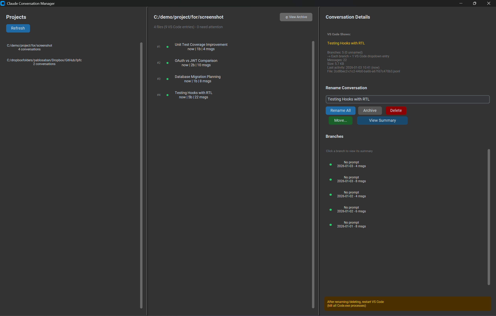

# Claude Conversation Manager

A GUI and CLI tool for managing Claude Code VS Code extension conversations - rename, analyze, archive, move, and generate summaries.



## Understanding VS Code Claude Code Extension Architecture

### Where Conversations Are Stored

Claude Code stores conversations in `.jsonl` files located at:
- **Windows**: `C:\Users\<username>\.claude\projects\`
- **macOS/Linux**: `~/.claude/projects/`

Each workspace/folder gets its own project directory with a mangled path name:
```
.claude/projects/
├── c--dropboxfolders-user-GitHub-myproject/     # From C:/dropboxfolders/user/GitHub/myproject
│   ├── 8a2dc9e2-f245-487d-8014-f60c8e9cf61a.jsonl
│   ├── e33ee449-2f36-4c84-9603-b3580982b600.jsonl
│   └── agent-*.jsonl  (MCP agent files, ignored)
└── C--Users-me/
    └── ...
```

### Critical Insight: Branches vs Files

**This is the most important thing to understand:**

| Concept | What It Is | VS Code Behavior |
|---------|-----------|------------------|
| **File** | One `.jsonl` file | Container for conversation data |
| **Branch** | A path from root to leaf node | **Each branch = 1 dropdown entry** |
| **Leaf** | End of a conversation path | Unique identifier for a branch |

A single conversation FILE can have **many branches** (due to conversation forking, session continuations, etc.). VS Code shows **each branch as a separate entry** in the "Past Conversations" dropdown.

Example:
- File `8a2dc9e2.jsonl` has 39 branches
- VS Code dropdown shows **39 separate entries** for this file
- Each entry can have a different name if branches have different summaries

### The Naming Problem

The extension determines what to show in the dropdown by:

1. Finding all leaf nodes (branch endpoints) in the file
2. For each leaf, checking if a `summary` record exists with that `leafUuid`
3. If found → show the summary text
4. If not found → show the first user message (often cryptic: "i need to work on the...")

**Why simple renaming doesn't work:**
- The extension can pick ANY branch to display
- If you only rename ONE branch, the others still show the old name
- You need summary records for ALL leaves to ensure consistent naming

### Orphan Summary Files

We discovered another quirk: **summary-only files** can exist that reference leaves in OTHER files. These create duplicate/garbage entries in the dropdown:

```
b4a159f7.jsonl (orphan):
  - 76 summary records
  - 0 actual messages
  - References leaves in 8a2dc9e2.jsonl, e33ee449.jsonl, etc.
  - Creates 76 duplicate dropdown entries!
```

The Conversation Manager identifies and helps clean up these orphans.

## Features

### GUI Application (Recommended)


Launch with: `launch-gui.bat` (Windows) or `python -m claude_conv_manager.gui`

**Three-Panel Interface:**
- **Left**: Project list with conversation counts
- **Center**: Conversations sorted by activity, with search bar and branch counts
- **Right**: Details, rename, and branch management

**Key Features:**
- 🏷️ **Rename All Branches** - Updates ALL leaves so the name appears consistently
- 📦 **Archive & Restore** - Move conversations to archive folder (hidden from VS Code). Click "View Archive" to see archived conversations and restore them.
- 🗑️ **Delete** - Permanently remove conversations
- 📁 **Move to Project** - Relocate conversations between workspaces
- 📊 **View Summary** - Generate AI-free summary of conversation content
- 🔍 **Branch Summaries** - Click any branch to see what that specific path discussed
- 🔎 **Search** - Full-text search across all conversations in a project (searches branch names and message content)

**Visual Indicators:**
- 🟢 Green dot: Branch has a name (summary exists)
- 🔴 Red dot + number: Unnamed branches needing attention
- Relative time display (now, 14d, 1mo) matching VS Code's format
- 📦 "View Archive" button to toggle between active and archived conversations

### CLI Interface

```bash
# List all projects
claude-conv-manager list

# List conversations in a project
claude-conv-manager list --project myproject

# Analyze a conversation
claude-conv-manager analyze "path/to/conversation.jsonl"

# Rename all branches
claude-conv-manager rename "path/to/conversation.jsonl" --name "My New Name"

# Health check
claude-conv-manager health
claude-conv-manager health --all
```

## Installation

```bash
# Clone the repository
git clone https://github.com/psaban20/claude-conversation-manager.git
cd claude-conversation-manager

# Install with GUI support (recommended)
pip install -e ".[gui]"

# Or CLI only
pip install -e .
```

### Requirements
- Python 3.10+
- CustomTkinter (for GUI)
- Windows, macOS, or Linux

## How the Renaming Works

### File Structure
```
conversation.jsonl
├── Summary Records: {"type":"summary","summary":"Name","leafUuid":"abc123"}
├── Messages: {"uuid":"abc123","parentUuid":"def456","type":"user",...}
└── Other records (queue-operations, etc. - ignored)
```

### Our Approach

1. **Parse** the .jsonl file to build a message tree
2. **Find all leaves** (messages with no children = branch endpoints)
3. **Filter** out sidechain branches (internal extension bookkeeping)
4. **Generate/update summary records** for EVERY leaf
5. **Write** back to file with proper JSON formatting

```
Before: 15 branches, only 1 has summary → VS Code shows random names
After:  15 branches, all 15 have summary → VS Code always shows "My Name"
```

## Important: VS Code Caching

⚠️ **After ANY changes, you MUST restart VS Code:**

1. Close all VS Code windows
2. Kill all `Code.exe` processes:
   - Windows: Task Manager → Details → End all Code.exe
   - macOS/Linux: `pkill -f "Visual Studio Code"`
3. Reopen VS Code

The extension caches conversation data in memory and doesn't detect file changes.

## ⚠️ Warnings & Caveats

Before using this tool, please understand these important behaviors:

### 1. Back Up First
**Always back up your `.claude` folder before making bulk changes.**
```
# Windows
xcopy "%USERPROFILE%\.claude" "%USERPROFILE%\.claude-backup" /E /I

# macOS/Linux  
cp -r ~/.claude ~/.claude-backup
```

### 2. Renaming Overwrites ALL Branch Names
When you rename a conversation, this tool updates **every branch** to the same name. If your conversation evolved through multiple sessions with different topics, you'll lose that context:

```
Before rename:
  Branch 1: "Setting up authentication"
  Branch 2: "Fixing login bug"  
  Branch 3: "Adding OAuth support"

After rename to "Auth Work":
  Branch 1: "Auth Work"
  Branch 2: "Auth Work"
  Branch 3: "Auth Work"
```

**This is intentional** - it ensures consistent naming regardless of which branch VS Code picks. But if you valued the historical progression of names, consider whether renaming is right for that conversation.

### 3. VS Code Dropdown ≠ Conversation Manager List
The mapping is not 1:1:

| Conversation Manager | VS Code Dropdown |
|---------------------|------------------|
| Shows **files** (grouped) | Shows **branches** (flat list) |
| 27 files | Could be 170+ entries |
| Sorted by file modification | Sorted by branch timestamp |

A single file with many branches appears as **many separate entries** in VS Code's dropdown.

### 4. The Extension May Regenerate Names
Claude Code extension can create new summary records during normal use. If you continue a conversation after renaming, the extension might:
- Add new branches with auto-generated names
- Create new summary records that differ from your custom name

You may need to re-rename conversations you actively use.

### 5. "Orphan" Summary Files Can Cause Chaos
We discovered that summary-only files (containing name records but no actual messages) can exist. These create duplicate/garbage entries in VS Code. Signs of this problem:
- Same conversation name appears many times with different dates
- Dropdown has entries like "API Error: 401..." repeated dozens of times

**Solution**: Delete or archive these orphan files. The Conversation Manager helps identify them (files with 0 messages but multiple summaries).

### 6. Archive Is Just a Subfolder
The "Archive" feature simply moves files to a `/archive` subfolder within the project. The Claude Code extension doesn't scan subfolders, so archived conversations disappear from the dropdown. This is not encryption or secure deletion - the files are still there and readable.

### 7. Multi-Root Workspaces Are Tricky
If you use VS Code workspaces with multiple folders:
- Conversations are associated with the **first folder** listed in the workspace
- Opening the same folder directly vs. via workspace may show different conversations
- Use "Move to Project" if conversations ended up in the wrong project

### 8. Large Conversations May Be Slow
Conversations with thousands of messages or dozens of branches take longer to:
- Load in the Conversation Manager
- Generate summaries
- Rename (writing many summary records)

The tool doesn't have a progress indicator for these operations yet.

### 9. This Tool Modifies Claude's Internal Files
This tool directly manipulates `.jsonl` files that the Claude Code extension owns. While we've reverse-engineered the format carefully:
- Anthropic could change the format in future updates
- There's no official API or documentation for this
- Use at your own risk

### 10. Names Have Character Limits
Very long names may be truncated in the VS Code dropdown. Keep names under ~60 characters for best display.

---

## Troubleshooting

### "I renamed but VS Code still shows old name"
- Did you kill ALL Code.exe processes?
- Check if there are orphan summary-only files creating duplicates
- Use the GUI to verify the rename took effect

### "VS Code shows the same name multiple times"
- This happens when a summary-only file references leaves in other files
- Use Conversation Manager to identify and delete orphan files
- Or archive the conversations you don't need

### "Conversation count doesn't match VS Code dropdown"
- VS Code shows branches, not files
- A file with 39 branches = 39 dropdown entries
- The GUI stats show: `27 files (170 VS Code entries)`

### "My workspace conversations aren't showing"
- VS Code associates conversations with the FIRST folder in a workspace
- For multi-root workspaces, ensure your target folder is listed first
- Use "Move to Project" to relocate conversations to the correct project

## Project Structure

```
claude-conversation-manager/
├── src/claude_conv_manager/
│   ├── __init__.py      # Package exports
│   ├── core.py          # Data models, analysis, rename, search logic
│   ├── cli.py           # Command-line interface
│   └── gui.py           # CustomTkinter GUI application
├── launch-gui.bat       # Windows GUI launcher
├── pyproject.toml       # Package configuration
└── README.md
```

## Roadmap

- [x] Core library for analysis and renaming
- [x] CLI interface
- [x] GUI application with three-panel layout
- [x] Archive/restore functionality
- [x] Move between projects
- [x] Conversation summaries
- [x] Branch-level summaries
- [x] Resizable panes
- [x] Conversation search
- [ ] Batch rename operations
- [ ] Branch visualization (tree view)
- [ ] Orphan file detection and cleanup wizard
- [ ] Export conversations to markdown

## License

MIT License - see LICENSE file for details.

## Contributing

Contributions welcome! Please open an issue to discuss changes before submitting PRs.

---

*Built to solve the frustration of cryptic conversation names in Claude Code's Past Conversations dropdown.*
